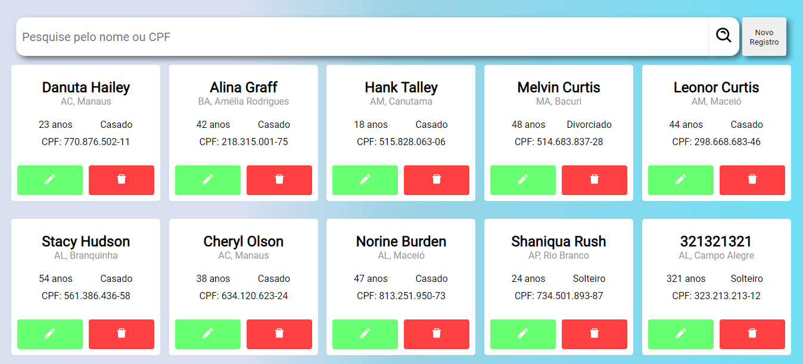
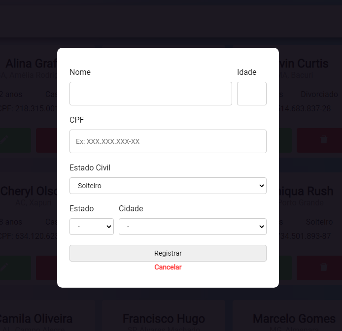

<h1 align="center">Softwrap</h1>
<p align="center">Simples App para cadastrar e buscar usuários</p>




Tabela de conteúdos
=================
<!--ts-->
   * [Sobre](#Sobre)
   * [Tabela de Conteudo](#tabela-de-conteudo)
   * [Instalação](#instalacao)
   * [Como usar](#como-usar)
   * [Tecnologias](#Tecnologias)
   * [Funcionalidades](#Funcionalidades)
<!--te-->

### Funcionalidades
- [x] Cadastrar usuário
- [x] Editar informações do usuário
- [x] Listar usuários
- [x] Paginação
- [x] Filtro por idade, região e estado civil

### Tecnologias
- [ReactJs](https://pt-br.reactjs.org/)
- [Styled-Components](https://styled-components.com/)
- [React-Icons](https://react-icons.github.io/react-icons/)
- [Axios](https://github.com/axios/axios)
- [Yarn Workspaces](https://classic.yarnpkg.com/en/docs/workspaces/)
- [Express](https://expressjs.com/)
- [Firebase Realtime Database](https://firebase.google.com/docs/database?hl=pt-br)
- [Eslint](https://eslint.org/), [Prettier](https://prettier.io/) and [EditorConfig](https://editorconfig.org/)


### Como usar
````bash
# Clone o repositório
$ git clone https://github.com/Tsugami/Softwrap softwrap

# Entre na pasta
$ cd softwrap

# Instale as dependencias
$ yarn install

# Inicie o servidor
$ yarn server start

# Inicie o site
$ yarn client start
````

### Desições e Problemas
#### Limitações da Firebase Realtime Database
Fiz todos filtros e paginações com TDD, antes mesmo de criar as rotas, todos eles testava os filtros individualmente, nenhum testava 2 filtros ao mesmo tempo, quando fui testar as rotas pelo Insomia, recebi um erro da firebase, falando que não podia fazer duas filtros ao mesmo tempo. compreensivel já que o realtime é `key & value`. Resolvi buscando todos os usuários e fazendo o filtro manualmente, não concordo em buscar todos os usuários, se a demanda fosse grande usaria bastante da maquina e poderia retornar usuários desatualizados. Dependendo migrar para `Cloud Firestore`, vi que ele tem queries mais ideias para filtros.
#### Validações
As validações foram separadas em middlewares, para serem reutilizadas no `create` e `update`.

#### Repository Pattern
Sempre uso `Repository Pattern` em meus projetos, mas foi a primeira vez que eu senti o real sabor de usa-lo, quando fui refazer os filtros de busca, só alterei o `UserRepo` e os controllers e tests rodaram perfeitamente, sem quaisquis alterações.

